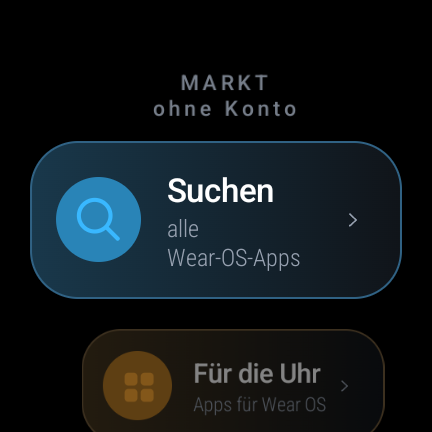
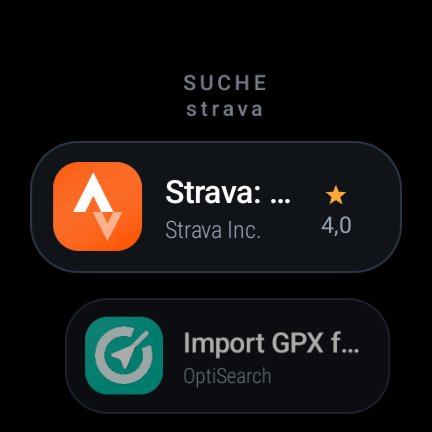
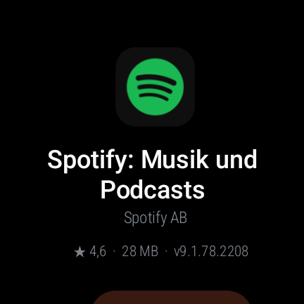
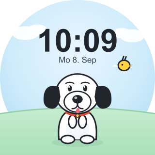

<div align="center">

# ⌚ Herold

### Eine Galaxy Watch am iPhone betreiben — ohne Google-Konto, ohne Samsung-Handy

Benachrichtigungen, Gesundheitsmessungen, ein eigener App-Laden und eigene
Ziffernblätter. Alles selbst gebaut, alles ohne Gradle.

<br>

[](LICENSE)
[](https://wearos.google.com/)
[](docs/01-bauen-ohne-gradle.md)
[](docs/04-markt.md)

[](#voraussetzungen)
[](#voraussetzungen)
[](docs/03-herold.md)
[](#-dokumentation)

[](https://ko-fi.com/chackrahunter)
[](https://www.paypal.me/Donsko2007)

<br>

[**Einrichten**](docs/00-uhr-einrichten.md) ·
[**Doku**](#-dokumentation) ·
[**Erkenntnisse**](docs/07-erkenntnisse.md) ·
[**Unterstützen**](#-unterstützen)

</div>

---

## Worum es geht

Samsung sieht diese Kombination nicht vor: Eine Galaxy Watch ab Modell 4 lässt
sich **offiziell nur mit einem Android-Telefon** einrichten und verwalten. Mit
einem **iPhone** bleibt sie eine teure Uhr ohne Benachrichtigungen, ohne
App-Store und ohne Zugriff auf ihre eigenen Sensoren.

Dieses Projekt macht sie trotzdem vollständig nutzbar — und zwar **ohne
Google-Konto**, **ohne Samsung-Telefon** und **ohne Play Store**.

Entstanden ist es, weil meine Mutter eine Galaxy Watch 6 Classic hat und ein
iPhone. Alles hier läuft täglich auf genau dieser Uhr.

<div align="center">

| Laden: Start | Laden: Suche | Laden: App-Seite | Beispiel-Ziffernblatt |
|:---:|:---:|:---:|:---:|
|  |  |  |  |

</div>

---

## ✨ Was drin ist

<table>
<tr>
<td width="50%" valign="top">

### 📲 `herold/` — Die Brücke zum iPhone

Holt Benachrichtigungen per **ANCS** direkt vom iPhone auf die Uhr — ohne
Umweg, ohne fremde App, ohne Abo.

Dazu die Sensoren, die Samsung sonst hinter der eigenen App versteckt:

- **EKG** (30 s, 500 Hz) mit Kurve und Auswertung
- **Puls & Rhythmus** mit ehrlicher Rhythmusanalyse
- **Sauerstoff (SpO₂)**, **Hauttemperatur**, **Körperanalyse**
- **Atemfrequenz** aus den Schlagabständen
- **Pulsankunftszeit** aus EKG + PPG
- Kacheln, Verlauf mit Detailansicht, Hintergrundmessungen

</td>
<td width="50%" valign="top">

### 🛒 `markt/` — App-Laden ohne Konto

Meldet sich **anonym** bei Google Play an und installiert Apps direkt auf der
Uhr — kein Google-Konto nötig.

- Zeigt gezielt **nur Wear-OS-Apps** und Ziffernblätter
- Katalog aus Googles eigenen Wear-Kategorien (~1000 Einträge)
- Suche über ganz Play
- Update-Prüfung für alle selbst installierten Apps
- Installation gezielter älterer Versionen

</td>
</tr>
<tr>
<td width="50%" valign="top">

### 🎨 `zifferblatt/` — Eigenes Ziffernblatt

Ein vollständiges, lauffähiges Beispiel mit eigener Zeichnung: Hintergrund,
Uhrzeit, Datum, sparsamer Ruhemodus — und der Griff, das Blatt **per adb aktiv
zu setzen**.

</td>
<td width="50%" valign="top">

### 🔧 `werkzeuge/` — Alltag

- `uhr.sh` — Verbindung zur Uhr finden und halten
- `entruempeln.sh` — Bloatware **umkehrbar** entfernen
- `apps.sh` — Apps aufspielen, starten, prüfen

</td>
</tr>
</table>

---

## 🚀 Schnellstart

> [!IMPORTANT]
> **Noch keine eingerichtete Uhr?** Eine Galaxy Watch 4+ lässt sich offiziell nur
> mit einem Android-Telefon einrichten. Den von Samsung selbst dokumentierten Weg
> daran vorbei findest du in
> **[docs/00-uhr-einrichten.md](docs/00-uhr-einrichten.md)** — **dort anfangen.**

```bash
git clone https://github.com/chackrahunter/herold.git
cd herold
```

**1. Bibliotheken holen.** Sie liegen bewusst **nicht** im Repo (sie gehören
anderen). Wie du sie bekommst, steht in
[docs/02-bibliotheken.md](docs/02-bibliotheken.md). Sie kommen in
`herold/libs/`, `markt/libs/` bzw. `zifferblatt/libs/`.

**2. Pfade prüfen.** In jedem `build.sh` stehen oben `SDK=` und `JAVA_HOME`.

**3. Uhr verbinden** (WLAN-Debugging auf der Uhr einschalten):

```bash
./werkzeuge/uhr.sh --id      # findet die Uhr per mDNS
```

**4. Bauen und aufspielen:**

```bash
cd herold && ./build.sh --install
```

> [!TIP]
> Beim ersten Bauen entsteht automatisch ein Signaturschlüssel. Er bleibt lokal
> und ist **nicht** im Repo — sonst könnte jeder Updates für deine App signieren.
> Sichere ihn trotzdem: Ohne ihn kannst du deine eigene App später nicht mehr
> aktualisieren.

---

## 🧰 Voraussetzungen

**Hardware**

| | |
|---|---|
| Uhr | Samsung Galaxy Watch 4 oder neuer — entwickelt und täglich getestet auf **Galaxy Watch 6 Classic (SM-R955F)**, Wear OS 4 bis 6 |
| Telefon | Ein **iPhone** für die Benachrichtigungsbrücke — oder gar keins |
| Rechner | macOS oder Linux zum Bauen |

**Software**

| | |
|---|---|
| Android SDK | **Command Line Tools** (`aapt2`, `d8`, `zipalign`, `apksigner`) + `platforms/android-33` |
| Java | **JDK 21** |
| adb | mit **WLAN-Debugging** zur Uhr |
| optional | `rsvg-convert` für die Grafiken des Ziffernblatts |

---

## 📚 Dokumentation

| | Worum es geht |
|---|---|
| [**00 — Uhr einrichten**](docs/00-uhr-einrichten.md) | Ohne Samsung-Handy an der Einrichtung vorbei. **Hier anfangen.** |
| [01 — Bauen ohne Gradle](docs/01-bauen-ohne-gradle.md) | Die Kette `aapt2 → javac → d8 → apksigner` und ihre Fallstricke |
| [02 — Bibliotheken](docs/02-bibliotheken.md) | Welche JARs du brauchst und wo du sie herbekommst |
| [03 — Herold](docs/03-herold.md) | ANCS-Brücke, Sensoren, Rhythmusanalyse, Hintergrundmessungen |
| [04 — Markt](docs/04-markt.md) | Anonyme Play-Anmeldung, Wear-Katalog, Installation, Updates |
| [05 — Zifferblatt](docs/05-zifferblatt.md) | Eigenes Ziffernblatt bauen und aktiv setzen |
| [06 — Werkzeuge](docs/06-werkzeuge.md) | `uhr.sh`, `entruempeln.sh`, `apps.sh` |
| [**07 — Erkenntnisse**](docs/07-erkenntnisse.md) | **Das Wertvollste:** Dinge, die nirgends stehen und Stunden gekostet haben |

> [!NOTE]
> Wenn du nur eine Seite liest, dann [**07 — Erkenntnisse**](docs/07-erkenntnisse.md).
> Dort steht unter anderem, warum ohne einen einzigen versteckten Schalter
> **jede** App-Installation fehlschlägt, und warum ein fremdes iPhone die Uhr
> nicht findet.

---

## ⚠️ Wichtige Hinweise

> [!CAUTION]
> **Die Gesundheitsmessungen sind kein Medizinprodukt.**
> Herold liest die Sensoren aus und rechnet Werte. Es stellt **keine Diagnose**,
> nennt **keine Krankheitsnamen** und gibt **keine Entwarnung**. Die
> Rhythmusanalyse sagt bewusst nur, ob der Herzschlag gleichmäßig war — nie, ob
> etwas „in Ordnung" ist. Bei Beschwerden zum Arzt, nicht zur Uhr.

**Das Entrümpeln ist umkehrbar.** `entruempeln.sh` entfernt Apps nur für den
Nutzer (`pm uninstall --user 0`). Nichts wird von der Systempartition gelöscht.
Reihenfolge: `--sichern` → `--probe` → `--weg`.

**Systemupdates setzen Eingriffe zurück.** Nach einem Wear-OS-Update kommt
entfernte Bloatware zurück, WLAN-Debugging ist aus und der Werksschutz-Modus
springt zurück. Einfach erneut ausführen.

**Rechtliches.** Der Code steht unter MIT. Er nutzt aber fremde Dienste und
Bibliotheken (Google Play, Samsung Health Sensor SDK, gplayapi) — prüfe selbst,
ob deine Nutzung deren Bedingungen entspricht. Ziffernblätter mit geschützten
Figuren gehören ihren Rechteinhabern; hier ist keine dabei.

---

## 💛 Unterstützen

Dieses Projekt entsteht in meiner Freizeit und **finanziert sich
ausschließlich über Spenden**. Es gibt keine Firma dahinter, keine Werbung, kein
Abo und keine Datensammlung — nur die Zeit, die ich hineinstecke.

**Nur wenn genug zusammenkommt, kann ich daran weiterarbeiten**: neue Funktionen,
Anpassungen an kommende Wear-OS-Versionen und Hilfe für alle, die es nachbauen.
Wenn dir das etwas wert ist oder dir das Projekt Zeit gespart hat, freue ich mich
über jede Unterstützung — egal wie klein.

<div align="center">
<br>

<a href="https://ko-fi.com/chackrahunter"></a>
&nbsp;
<a href="https://www.paypal.me/Donsko2007"></a>

<br>
</div>

- **Ko-fi:** [ko-fi.com/chackrahunter](https://ko-fi.com/chackrahunter)
- **PayPal:** [paypal.me/Donsko2007](https://www.paypal.me/Donsko2007)

Auch ohne Geld hilfst du: ⭐ einen Stern dalassen, Fehler melden, oder
weitersagen.

---

## 🤝 Mitmachen

Fehlerberichte und Verbesserungen sind willkommen — besonders Erfahrungen mit
**anderen Uhrenmodellen**. Wenn etwas bei dir anders läuft, schreib gern ein
Issue mit Modell, Wear-OS-Version und dem, was passiert ist.

---

<div align="center">

**MIT-Lizenz** · siehe [LICENSE](LICENSE)

<sub>Gebaut für eine Galaxy Watch 6 Classic an einem iPhone 14.</sub>

</div>
